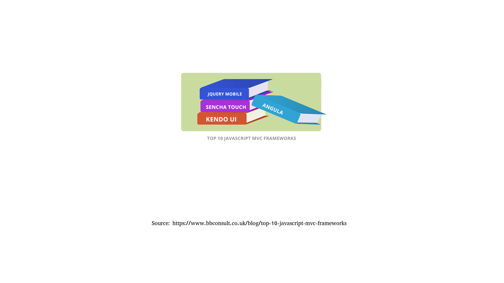

# Deep dive into microfrontend architecture

 
 

by Matthias Hryniszak

---

## What is "architecture"?

 

### So let's get the obvious stuff out of the way...

---

(this page is intentionally left blank)

---

## Disclaimer

For the purposes of this presentation the word "Architecture" will be used in all cases where information exchange happens:

 

- <b>defining an interface</b> (interface, class, method, module, subsystem, etc)
- <b>defining communication medium</b> (stack, heap, file, network, etc)

 

Both of those need to be present at the same time.

---

# What does an architect do?

---

## Principles of architecture - dev

 

1. Ease of development
2. Ease of deployment
3. Extensibility
4. Maintainability

---

## Principles of architecture - ops

 

1. High availability
2. Performance
3. Security
4. Accounting

---

---

---

---

---

---

# Stop talking - start coding!

---

# Remember the 8 principles

1. Ease of development
2. Ease of deployment
3. Extensibility
4. Maintainability

&nbsp;

1. High availability
2. Performance
3. Security
4. Accounting

---

